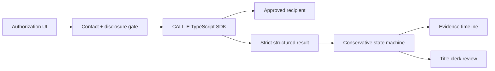

# VINRelease

VINRelease is an evidence-first title exception desk for used-car dealerships. When a purchased vehicle is stuck without a title, it uses governed CALL-E calls to identify the exact blocker, follow the next responsible party, and move the case only when the structured phone result supports that move.

- **Public demo:** https://vinrelease.vercel.app
- **Source:** https://github.com/vivekyarra/vinrelease
- **CALL-E gallery contribution:** https://github.com/CALLE-AI/awesome-phone-call-agents/pull/463

### Verified live proof

One CALL-E call to a user-controlled test number completed on September 11, 2026 (`call_rkZ1HkMxxjswZKSx1CjCkA`). CALL-E returned three evidence items and a schema-valid `needs_human` result because the recipient indicated the synthetic case could be located but the conversation ended before a blocker or owner was established. This proves runtime CALL-E execution and a conservative uncertainty handoff; it does not prove a real title was released. The public two-call scenario below is a deterministic, no-call replay.

The default experience is a complete no-call replay. It demonstrates a two-call chain: an auction identifies a missing lien release, then a lienholder supplies reference `LR-4721` while physical receipt remains unconfirmed. A second scenario proves the fail-closed path when a recipient asks for a credential.

## Why it exists

Title clerks lose hours calling auctions and lienholders for status updates. Generic automation can record a summary, but it can also mistake “sent” for “received,” reveal too much information, or keep calling the wrong party. VINRelease treats phone evidence as input to a strict state machine. Unknowns and unsafe requests stop with a person.

## Run the safe demo

Requirements: Node.js 20 or newer.

```bash
npm install
npm run dev
```

Open `http://localhost:3000`, select **Resolve next blocker**, review the exact recipient and disclosure packet, authorize the safe demo, and repeat for the lienholder. Choose **Unsupported credential request** to see the human-review branch. No phone call is placed in demo mode.

## Live CALL-E mode

Copy `.env.example` to `.env.local` and set:

```dotenv
VINRELEASE_MODE=live
CALLE_API_KEY=your_server_side_key
CALLE_AUCTION_PHONE=+15551234567
CALLE_AUCTION_REGION=US
CALLE_AUCTION_LOCALE=en-US
CALLE_LIENHOLDER_PHONE=+15557654321
CALLE_LIENHOLDER_REGION=US
CALLE_LIENHOLDER_LOCALE=en-US
PUBLIC_BASE_URL=https://your-public-host.example
VINRELEASE_LIVE_RUN_ID=team-controlled-proof-01
```

Both destinations must be E.164 numbers controlled by, or explicitly consented for, the operator. `CALLE_API_KEY` stays server-side. The app creates one CALL-E task only after a user checks the per-call authorization box. It uses `@call-e/calle`, a strict recipient result schema, and a stable idempotency key. The live response is polled by provider call ID; terminal webhooks are deduplicated and reconciled through the Calls API.

For a judge-recordable proof run, configure a fresh `VINRELEASE_LIVE_RUN_ID` and one consenting `CALLE_AUCTION_PHONE`, then run:

```bash
npm run verify:live -- --confirm-one-real-call
```

The command refuses to call unless live mode, the API key, a fresh run label, a valid approved destination, and the explicit confirmation flag are all present. It creates at most one idempotent CALL-E task for that run label, prints the provider call ID immediately, waits for the terminal result, validates the same strict schema used by the app, and prints a redacted proof summary. Reusing the run label reuses the same idempotency key.

## Safety and side effects

- Default mode is a deterministic replay and cannot place calls.
- Live mode makes exactly one outbound call to the displayed, pre-provisioned contact after explicit authorization.
- The CALL-E SDK is pinned to the official `https://api.heycall-e.com` host; an environment variable cannot redirect the API key.
- Phone numbers are masked in the interface and never accepted through arbitrary user input.
- The task discloses that it is an automated agent calling for the dealership.
- Credentials, financial details, fees, legal representations, and unverified facts are outside the disclosure budget.
- “Sent” remains `WAITING_EXTERNAL`; it never becomes proof of physical receipt.
- Unknown, contradictory, wrong-department, or credential-seeking results become `NEEDS_HUMAN`.
- There is no recurring schedule. To cancel a queued or running live call, use the CALL-E dashboard; resetting VINRelease only resets the local case view and does not cancel a provider call.

Medical, emergency, legal-decision, payment, debt-collection, and identity-verification calls are outside this app’s supported workflow.

## Architecture



The hosted demo stores only a compact scenario step in an HTTP-only cookie and reconstructs the deterministic evidence chain per request, so it works across serverless instances. Live mode uses the repository boundary in `src/db/repository.ts`; production multi-user use should replace that in-process implementation with durable storage.

## Verification

```bash
npm run verify
```

The suite covers allowed contacts, disclosure limits, idempotency, structured-result rejection, conservative transitions, webhook deduplication, the two-call workflow, the human stop, and serverless demo reconstruction.

See [testing instructions](docs/TESTING.md), [architecture notes](docs/ARCHITECTURE.md), and the [three-minute demo script](JUDGE_READY_3_MINUTE_DEMO_VIDEO_SCRIPT.md).

## Hackathon

Built for **CALL-E: Your Code Is Calling**. Target track: **Most Practical**. The public deployment intentionally runs in safe demo mode; live verification requires consented recipient numbers and is kept separate from the judge-facing replay.

## License

MIT
